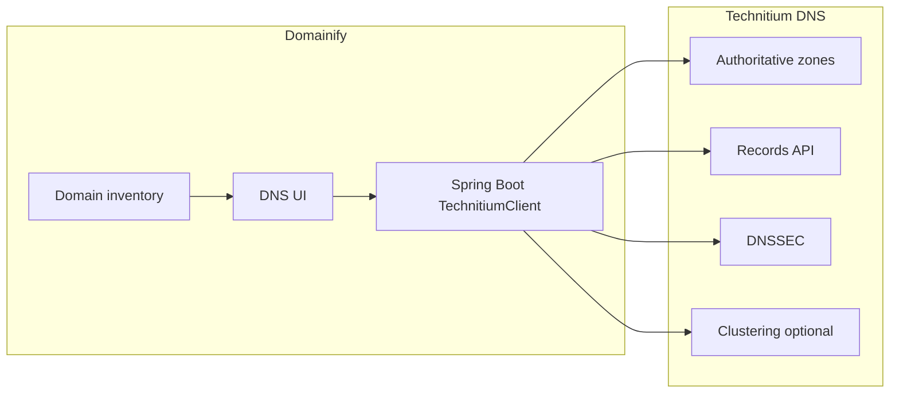

# Domainify + Technitium DNS — full feature list

**Decision:** use **[Technitium DNS Server](https://technitium.com/dns/)** (open source, HTTP API on port 5380, Docker-ready) as Domainify’s DNS engine. Domainify becomes the product UI; Technitium stores and serves zones/records.

Domainify already has ownership DNS TXT verification. Technitium can auto-create those TXT records once a zone is hosted.

Auth to Technitium: non-expiring **API token** (`/api/user/createToken`) stored in Domainify config (not end-user Technitium logins for v1).

---

## Tier 1 — Core (ship first; maps to domain inventory)

These are the features Domainify users expect when “DNS Management” is enabled for a domain.

### Zone lifecycle (per Domainify domain)

- Create **Primary** zone when enabling DNS for a domain (`/api/zones/create`)
- List / search zones and link them to Domainify `Domain` rows
- Enable / disable zone (soft take-offline without delete)
- Delete zone when DNS is unhosted or domain removed
- Show Domainify nameservers to copy at the registrar
- Detect whether registrar NS matches expected Technitium NS (health badge)
- **Clone zone** from a template zone (parking / email presets)
- **Import** zone file (RFC 1035) / **Export** zone file
- Zone options: transfer policy, notify secondaries, disabled flag (`/api/zones/options/*`)

### Record manager (per zone)

Supported record types via Technitium API (expose these in UI):

| Type             | Domainify use                                                     |
| ---------------- | ----------------------------------------------------------------- |
| **A / AAAA**     | Website / parking IP; optional auto-PTR + reverse zone            |
| **CNAME**        | CDN / alias                                                       |
| **ANAME**        | Apex alias (CNAME-at-root flattening) — high value for portfolios |
| **MX**           | Email                                                             |
| **TXT**          | SPF, DKIM, ownership verification, ACME DNS-01                    |
| **NS**           | Delegation / glue                                                 |
| **SRV**          | Service discovery                                                 |
| **CAA**          | SSL CA policy                                                     |
| **PTR**          | Reverse DNS                                                       |
| **DNAME**        | Domain rename / redirect at DNS level                             |
| **SSHFP**        | SSH host key fingerprints                                         |
| **TLSA**         | DANE (auto-hash from PEM in Technitium)                           |
| **SVCB / HTTPS** | Modern HTTPS service binding                                      |
| **URI**          | URI records                                                       |
| **DS**           | Child zone DNSSEC delegation                                      |
| **APP / FWD**    | Advanced only (see Tier 3)                                        |

Record UX features Technitium supports that Domainify can wrap:

- Add / get / update / delete records
- TTL per record
- **Comments** on records
- **Enable/disable** individual records (A/B testing, parking vs live)
- **Record aging** (`expiryTtl`) — auto-delete after N seconds (temp ACME challenges, short campaigns)
- **Overwrite** RRset option
- Wildcard names (`*.example.com`)
- Dynamic DNS helper: A/AAAA with `request-ip-address` for update clients
- Bulk edit / multi-select delete in Domainify UI (orchestrated over API)

### Portfolio automations (Domainify logic on top of Technitium)

- One-click **enable DNS** on a domain → create Primary zone + default NS/SOA
- Auto-insert **ownership verification TXT** into hosted zone
- Templates: parking A/ANAME, email (MX+SPF), “website” A/AAAA+www CNAME
- ACME **DNS-01** helper: add/remove `_acme-challenge` TXT with short `expiryTtl`
- Sync Domainify domain rename → recreate/move zone carefully
- Audit log in Domainify of who changed which record

---

## Tier 2 — Advanced DNS (after Core)

### DNSSEC (full Technitium surface)

- Sign / unsign zone
- View **DS** records for registrar upload
- NSEC ↔ NSEC3 convert; NSEC3 params
- DNSKEY TTL, add/update/delete/publish private keys
- KSK/ZSK rollover & retire
- Show DNSSEC status on domain row (`SignedWithNSEC`, etc.)

### High availability / multi-server

- **Secondary** zones (AXFR/IXFR, NOTIFY)
- Zone transfer over **TLS / QUIC**
- **TSIG** keys for secure transfers
- **Catalog zones** (manage many zones via catalog)
- **Stub / Conditional Forwarder** zones (less common for public portfolio hosting)
- **Convert** zone type (Primary ↔ Secondary, etc.)
- **Resync** secondary
- Technitium **Clustering** — Domainify admin points at cluster; optional `node` param on API calls

### Zone permissions (multi-tenant later)

- Per-zone Technitium user/group permissions (`/api/zones/permissions/*`)
- Map Domainify orgs/users to Technitium groups if you multi-tenant the DNS server

### Built-in DNS client (admin / support)

- Query tool in Domainify admin (`DNS Client` API) to verify live answers
- Import query response into zone (support workflows)

---

## Tier 3 — Ops / platform (admin Domainify, not end-sellers)

Useful if Domainify operators run Technitium themselves:

### Dashboard & observability

- Query stats (LastHour / day / etc.)
- Top clients / top domains / top blocked
- Prometheus text metrics endpoint for Grafana
- Query logs + system logs (`Log` API)
- Flush / inspect recursive **cache** (if Technitium also resolves)

### Blocking / allow lists (recursive sinkhole mode)

- Blocked / allowed zones CRUD + import/export
- Block-list URLs (ads/malware) — only if Domainify offers “network DNS” product, not pure authoritative hosting

### DNS Apps

- Install/config apps via API (Split Horizon, Geo, Advanced Blocking, DNS64, etc.)
- Expose **APP** records for custom response logic (geo parking, affiliate redirects)
- Usually admin-only; high complexity

### Settings & administration

- Server settings get/set (listen IPs, recursion, forwarders DoT/DoH/DoQ)
- Certificates for DoT/DoH/DoQ self-host
- User/role management, TOTP 2FA on Technitium admin
- Backup/restore of Technitium config (ops runbooks; optional Domainify buttons)

### Out of scope for Domainify product UI (keep in Technitium console)

- Built-in **DHCP** server
- SOCKS/HTTP proxy / Tor routing for resolution
- Most recursive-privacy features (unless you sell a separate “private DNS resolver” product)

---

## Suggested Domainify product packaging

| Package          | Includes                                                                          |
| ---------------- | --------------------------------------------------------------------------------- |
| **DNS Basic**    | Tier 1 zones + A/AAAA/CNAME/ANAME/MX/TXT/NS/SRV/CAA + templates + ownership TXT   |
| **DNS Pro**      | + DNSSEC DS wizard, import/export, record aging, disable records, SVCB/HTTPS/TLSA |
| **DNS Platform** | + Secondary/cluster, catalog zones, per-zone permissions, admin metrics           |

---

## Implementation phases (Technitium-only)

1. **Phase 1 — Core wire-up**
  - Spring `TechnitiumClient` (token auth)
  - Config: base URL + API token
  - Domain detail → DNS tab: create zone, list/edit common records
  - Nameserver instructions + NS health check
2. **Phase 2 — Portfolio polish**
  - Templates, ownership TXT auto-write, ACME helper, clone/import/export, record comments/disable/aging
3. **Phase 3 — DNSSEC + HA**
  - Sign/unsign, DS display, secondary/TSIG, optional cluster
4. **Phase 4 — Admin ops** (optional)
  - Stats dashboard, logs, apps — admin role only

---

## Confirm before coding

Reply with which package to start:

- **DNS Basic only** (Phase 1–2), or
- **Basic + DNSSEC** (through Phase 3), or
- **Full platform** (all tiers)

Also confirm: will Domainify host **one shared Technitium** for all customers, or **one Technitium per tenant**?